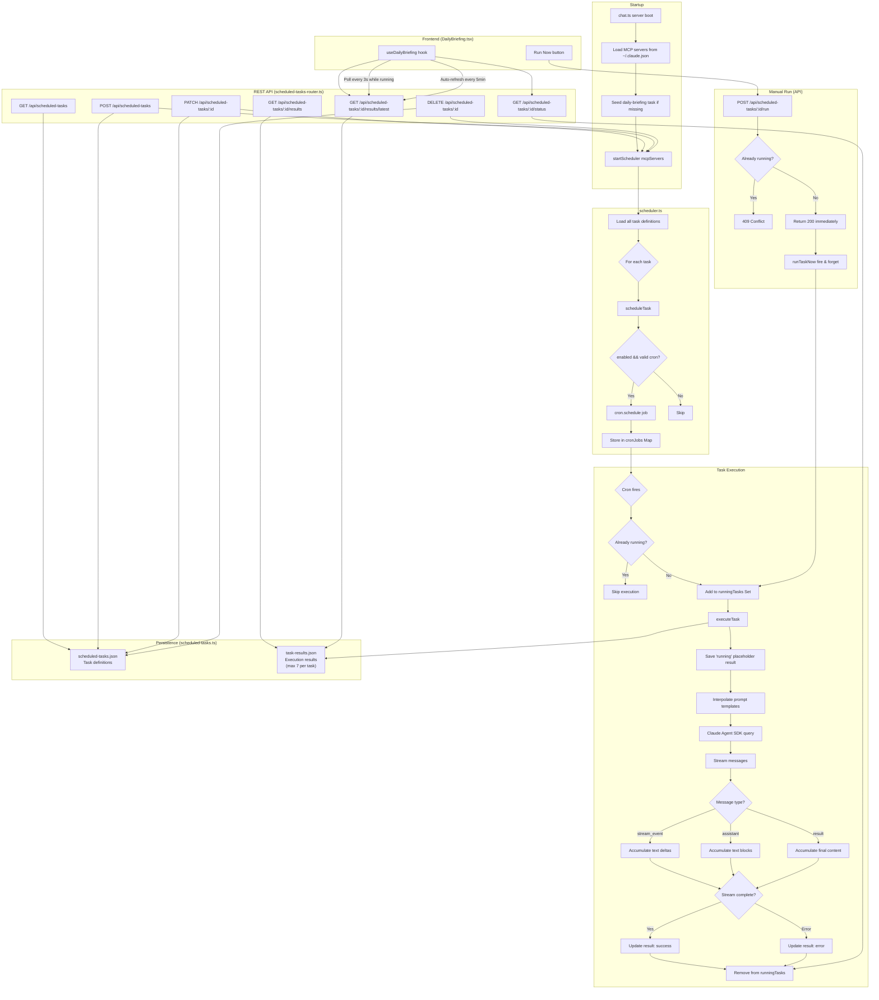

# Product Dashboard

A personal work dashboard that combines an AI chat assistant (Claude Agent SDK) with tools for managing daily work. Built with React Router 7, Mantine UI, Tailwind CSS, and Express.

## Features

- AI chat assistant with Claude Agent SDK (streaming, session resumption, MCP tool access)
- Daily notes integrated with Obsidian vault
- Task management organized by category (bet, client, partner, JIRA, general)
- JIRA integration (Ideas, Epics, Stories, delivery tracking)
- Product bet management from Obsidian vault
- Client and partner tracking
- Meeting note processing (via Granola MCP)
- Scheduled tasks with cron (daily briefings, etc.)
- Competitive intelligence agent

## Quick Start

### 1. Clone and install

```bash
git clone https://github.com/claimshero/product-dashboard.git
cd product-dashboard
npm install
```

### 2. Configure environment

Copy the example env file and fill in your values:

```bash
cp .env.example .env
```

**Required (dual-vault setup):**
- `OBSIDIAN_PERSONAL_VAULT_PATH` — absolute path to the local-only personal vault (Daily notes, Tasks, raw meeting notes)
- `OBSIDIAN_CLAIMABLE_VAULT_PATH` — absolute path to the team-shared vault (Product, Business, Reference, Templates, Agents). Synced via Obsidian Sync.
- `ANTHROPIC_API_KEY` — your Anthropic API key (for Claude Agent SDK)

During the transition to a physically split vault, `OBSIDIAN_VAULT_PATH` can be set as a fallback — it's used for either vault if the dedicated var is missing.

**Optional:**
- `USER_NAME` — your name (used in AI prompts, defaults to "User")
- `JIRA_BASE_URL` — your Atlassian instance URL (e.g., `https://your-org.atlassian.net`)
- `JIRA_EMAIL` — your Atlassian email
- `JIRA_API_TOKEN` — [create one here](https://id.atlassian.com/manage-profile/security/api-tokens)
- `DAILY_NOTE_TEMPLATE` — template path relative to vault (defaults to `Templates/Daily Rundown.md`)
- `CHAT_PORT` — chat server port (defaults to `4001`)
- `PORT` — web server port (defaults to `4000`)

### 3. Set up your Obsidian vault

The dashboard reads and writes directly to your Obsidian vault. It expects this folder structure:

```
Your Vault/
├── Product/
│   ├── company-context.md
│   ├── team-operating-model.md
│   ├── bet-structure.md
│   ├── bet-to-delivery-workflow.md
│   ├── Bets/
│   │   └── [bet-slug]/
│   │       ├── bet.md
│   │       └── notes/
│   ├── Clients/
│   │   └── [client-slug]/
│   │       ├── client.md
│   │       └── notes/
│   └── Partners/
│       └── [partner-slug]/
│           ├── partner.md
│           └── notes/
├── Business/                        # Optional (for intel-agent)
│   ├── Strategy/
│   │   └── strategic-context-snapshot.md
│   ├── Competitive Intelligence/
│   │   ├── watch-list.md
│   │   ├── sources.md
│   │   ├── competitors/[slug]/profile.md
│   │   └── briefings/daily/ & weekly/
│   └── Partnerships/[slug]/partnership.md
├── Daily/
│   ├── YYYY-MM-DD.md
│   └── meetings/
├── Tasks/
│   └── [category].md
├── Templates/
│   └── Daily Rundown.md
└── Reference/
```

The required minimum to get started:
- `Daily/` — for daily notes
- `Tasks/` — for task management
- `Templates/Daily Rundown.md` — daily note template

Create other folders as you need them.

### 4. Start the dashboard

```bash
npm run dev
```

Opens at `http://localhost:4000`. Chat server runs on port 4001.

## Agents

The `agents/` directory contains Claude agent templates. These work standalone with Claude Code / Conductor or through the dashboard's chat. To install:

1. Copy agent files to `~/.claude/agents/`
2. Replace placeholder variables in each file:
   - `$PERSONAL_VAULT_PATH` — absolute path to the personal (local-only) vault (meeting-processor only)
   - `$CLAIMABLE_VAULT_PATH` — absolute path to the team-shared Claimable vault
   - `$JIRA_CLOUD_ID` — your Atlassian Cloud ID (run `getAccessibleAtlassianResources` MCP tool)
   - `$JIRA_DISCOVERY_PROJECT` — JIRA discovery project key (e.g., `DB`)
   - `$JIRA_DELIVERY_PROJECT` — JIRA delivery project key (e.g., `MVP`)
   - `$JIRA_PROJECT_KEY` — JIRA project key (for po-agent)

Not all agents need all variables — check the setup comment at the top of each file.

| Agent | Purpose | Required MCP |
|-------|---------|-------------|
| `bet-creator` | Creates product bets from problem discovery | None |
| `meeting-processor` | Processes meeting transcripts into notes, tasks, JIRA mappings | Granola, Atlassian |
| `intel-agent` | Competitive intelligence and market monitoring | None |
| `po-agent` | Creates Epics and User Stories in JIRA | Atlassian |

## MCP Server Configuration

The dashboard loads MCP servers from `~/.claude.json` and passes them to the Claude Agent SDK. Needed for full functionality:

| Server | Used For |
|--------|----------|
| Atlassian (`mcp.atlassian.com`) | JIRA issue lookups and creation |
| Granola | Meeting transcript access |

Both are optional — the dashboard works without them.

## Architecture

```
┌─────────────────────────────────────────────────┐
│ Browser (React Router 7 + Mantine UI)           │
│  ┌──────────┐ ┌────────────┐ ┌───────────────┐  │
│  │ Nav Tree  │ │Content View│ │  Right Panel  │  │
│  │ (bets,    │ │(details,   │ │  ┌─────────┐  │  │
│  │  jira,    │ │ delivery,  │ │  │Daily    │  │  │
│  │  clients) │ │ chat)      │ │  │Notes    │  │  │
│  └──────────┘ └────────────┘ │  ├─────────┤  │  │
│                               │  │Tasks    │  │  │
│                               │  └─────────┘  │  │
│                               └───────────────┘  │
└──────────────────────┬──────────────────────────┘
                       │ HTTP + SSE
┌──────────────────────┴──────────────────────────┐
│ Chat Server (Express, port 4001)                 │
│  ├── Claude Agent SDK (streaming, MCP tools)     │
│  ├── Obsidian vault read/write                   │
│  ├── JIRA REST API                               │
│  ├── Task management (Tasks/*.md)                │
│  ├── Daily notes + activity log                  │
│  └── Scheduled tasks (cron)                      │
└──────────────────────────────────────────────────┘
```

## Development

```bash
npm run dev           # Start both servers
npm run dev:web       # Web server only
npm run dev:chat      # Chat server only
npm run migrate:tasks # Migrate tasks from daily notes to task files
```

## Scheduler Architecture


