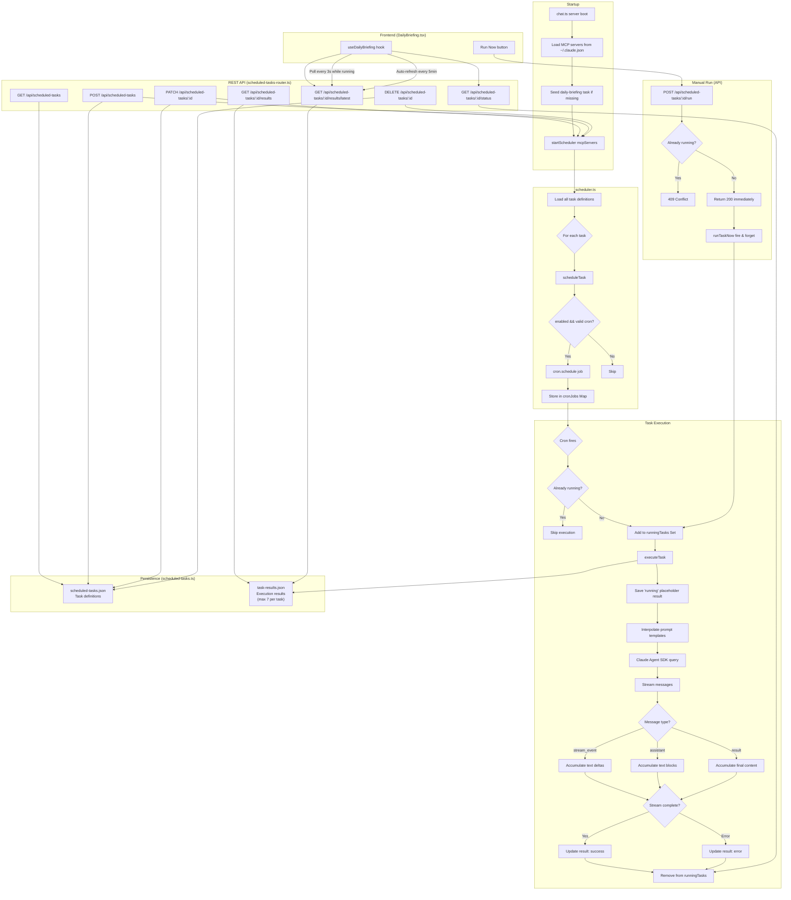

# Work Dashboard

A personal work dashboard that combines an AI chat assistant (Claude Agent SDK) with tools for managing daily work. Built with React Router 7, Mantine UI, Tailwind CSS, and Express.

## Scheduler Architecture



## Development

```
npm run dev        # Start both servers (web + chat)
npm run dev:web    # Web server only (port 4000)
npm run dev:chat   # Chat server only (port 4001)
```
